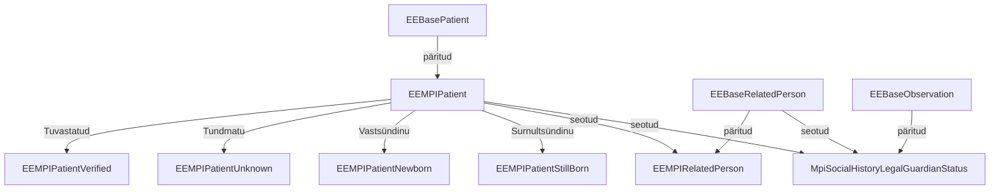

Patsiendi üldandmete teenus (PÜT) põhineb EEBase EEBasePatient, EEBaseRelatedPerson ja EEBaseObservation profiilidel.

Väljavõte EE MPI profiilide sõltuvusgraafist:

### EEMPIPatient

Profiilid on vajalikud andmekoosseisude valideerimiseks. Selle eesmärgiga profiilid luuakse iga kasutusjuhu jaoks eraldi ja välditakse liiga üldiste profiilide
kasutamist.

[EE MPI Patient](StructureDefinition-ee-mpi-patient.html) on abstraktne profiil, mille eesmärk on kirjeldada üldised MPI piirangud.

Võrreldes EEBase-iga ei toeta MPI: 
* *maritalStatus*, 
* *photo*, 
* *contact*, 
* *generalPractitioner*, 
* *managingOrganization* 
* *link* elemente sisendina ja ei
töötle neid kui neid edastatakse teenusele.
Samas pakub teenus patsientide [sidumise ja lahti sidumise](link.html) tegevusi ning sidumise tulemusi väljastab *link* elemendis.

Kasutusjuhu põhised patsiendi profiilid on

| Profiil                                                                    | Kasutusjuht                                           |
|----------------------------------------------------------------------------|-------------------------------------------------------|
| [EEMPIPatientVerified](StructureDefinition-ee-mpi-patient-verified.html)   | Dokumendi alusel tuvastatud patsiendi registreerimine |
| [EEMPIPatientUnknown](StructureDefinition-ee-mpi-patient-unknown.html)     | Tundmatu või anonüümse patsiendi registreerimine      |
| [EEMPIPatientNewborn](StructureDefinition-ee-mpi-patient-newborn.html)     | Vastsündinu patsiendi registreerimine                 |
| [EEMPIPatientStillborn](StructureDefinition-ee-mpi-patient-stillborn.html) | Surnult sündinud patsiendi registreerimine            |

### Ärianalüüs

- [Analüüsiraport](Patsientide_yldandmete_teenuse_protsessi_analyys.pdf)
- [PÜT andmekirjeldus](PYT-andmekirjeldus_2024-04-01.pdf)

