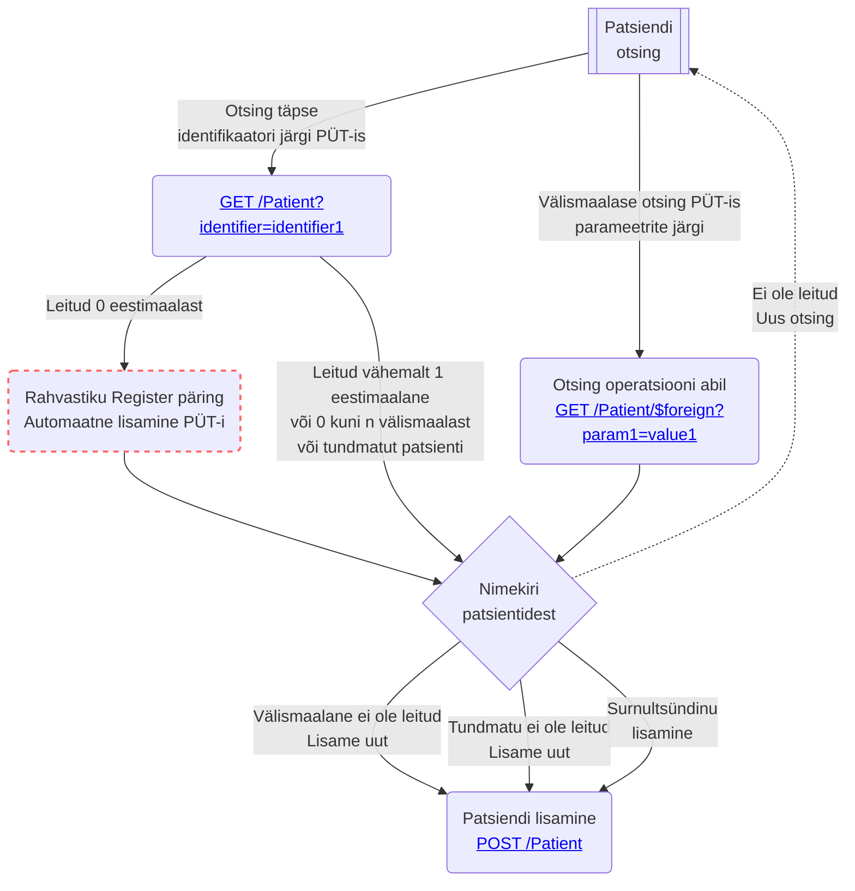

Järgmine diagramm annab ülevaate vajalikest sammudest patsiendi otsinguks:



### Otsingu komponent
**NB:** Tegemist on otsingu realiseerimise näidistega.


Paljudes tarkvarades on kasutusel patsiendi otsing ühe otsingu väljaga (Google stiilis). Et vältida liigsete andmete pärimist,
soovitame ühtlustada ühe väljaga otsingut vastavalt allpoolt toodud kirjeldusele, sest PÜT lisab kõik leitu
patsiendid auditlogisse. 

Allpool toodud pilt visualiseerib mõned otsingunäited: 
1) otsing Eesti isikukoodiga; 
2) välismaalase otsing, kus riigiks on määratud Portugal, perekonnanimi on
Ronaldo, eesnimi on Cristiano ja sünnikuupäev on 05.02.1985; 
3) tundmatu isiku otsing.

```drawio
PD94bWwgdmVyc2lvbj0iMS4wIiBlbmNvZGluZz0iVVRGLTgiPz4KICAgICAgPCFET0NUWVBFIHN2ZyBQVUJMSUMgIi0vL1czQy8vRFREIFNWRyAxLjEvL0VOIiAiaHR0cDovL3d3dy53My5vcmcvR3JhcGhpY3MvU1ZHLzEuMS9EVEQvc3ZnMTEuZHRkIj4KICAgICAgPHN2ZyB4bWxucz0iaHR0cDovL3d3dy53My5vcmcvMjAwMC9zdmciIHhtbG5zOnhsaW5rPSJodHRwOi8vd3d3LnczLm9yZy8xOTk5L3hsaW5rIiB2ZXJzaW9uPSIxLjEiIHdpZHRoPSIyODdweCIgaGVpZ2h0PSIxMjdweCIgdmlld0JveD0iLTAuNSAtMC41IDI4NyAxMjciIGNvbnRlbnQ9IiZsdDtteGZpbGUgaG9zdD0mcXVvdDtlbWJlZC5kaWFncmFtcy5uZXQmcXVvdDsgbW9kaWZpZWQ9JnF1b3Q7MjAyNC0wMi0xNFQxNTo0NjoxMi4wODBaJnF1b3Q7IGFnZW50PSZxdW90O01vemlsbGEvNS4wIChNYWNpbnRvc2g7IEludGVsIE1hYyBPUyBYIDEwXzE1XzcpIEFwcGxlV2ViS2l0LzYwNS4xLjE1IChLSFRNTCwgbGlrZSBHZWNrbykgVmVyc2lvbi8xNy4yLjEgU2FmYXJpLzYwNS4xLjE1JnF1b3Q7IGV0YWc9JnF1b3Q7LWJ2UW04SjRscGFyVzV4RjJkU2YmcXVvdDsgdmVyc2lvbj0mcXVvdDsyMy4xLjQmcXVvdDsgdHlwZT0mcXVvdDtlbWJlZCZxdW90OyZndDsmbHQ7ZGlhZ3JhbSBpZD0mcXVvdDt6VENhb204Y0VvNVhYNWZyZFdPTCZxdW90OyBuYW1lPSZxdW90O1BhZ2UtMSZxdW90OyZndDs1VmhSYjVzd0VQNDF2RmJZQmhJZXN6VHRLbTF0bFhUYXN3czNzQVFZT1U1STl1dG5naDNpbXExUkcyWForb1R2OHgzbSsrNjRFM2hrV201dUJhM3pyenlGd3NOK3V2SEl0WWN4OHJHdkxpMnk3WkJvcElGTXNGUTc5Y0NDL1FRVHFkRVZTMkZwT1VyT0M4bHFHMHg0VlVFaUxZd0t3UnZiN1FjdjdGTnJtb0VETEJKYXVPaDNsc3E4UThkNDFPT2ZnV1c1T1JsRmNiZFRVdU9zbVN4em12TG1BQ0l6ajB3RjU3SmJsWnNwRksxNFJwY3U3dVkzdS9zSEUxREpZd0p3RjdDbXhVcHpDK0xBSjRoRUlRcTlOamlpWmUyUlQ5WHpzcjM4NjlCTGU1Y0R1VFdKRlh4VnBkQnFnOVIya3pNSmk1b203VzZqU2xsaHVTd0x2ZTFxcmVWZmc1Q3dPWUMwOXJmQVM1QmlxMXpNTHRGMW9GK0VVSnROWDFYWXZCdjVRVVVGR3FPNmtMUDluZnRjcTRWTzkzRHFpWlA2MmVMcFdCM2ZveHN0V0ZhcGRhSjBBM0VxSVNOYnlKRWpaQkM0T3VMdy9Ub0dqbzZPUEpuU3B6NmU1YjV4MFdkekIvL1A3RTEvMmZkVGw3MUwvZ1RjdzllNVE1Vk8ycGFycklwWFlKZENYemUrc3BUckRXdlAybG11WHBvRHBGWjNkbFU1b0IwT3ZEd0dFMUJReWRaMlR4OVNRNS93eUpsNmtyN0U3SUFsWDRrRXRNOWh4elZoRzR1RUNaTlVaQ0Nkc0ozd2UwcEg1U0w2aUxsNG8vckRLVHhkTGtZRHVmajd3MjhJbWovY1Q3NWNQM2hZY2ZLbjg3dkYwOTNrL2x0bit1R1ZqNjlRUEE0dmJsQWlmTVpKT1hheStUai9ieVlsd3VjYmxmSGxqVXBFempVcnpjZkxtUnAwZkJrTitrS0hKVUlmTVJtWE1TMlYyWC9nZHU3OWJ3SXkrd1U9Jmx0Oy9kaWFncmFtJmd0OyZsdDsvbXhmaWxlJmd0OyIgc3R5bGU9ImJhY2tncm91bmQtY29sb3I6IHJnYigyNTUsIDI1NSwgMjU1KTsiPjxkZWZzLz48cmVjdCBmaWxsPSIjZmZmIiB3aWR0aD0iMTAwJSIgaGVpZ2h0PSIxMDAlIiB4PSIwIiB5PSIwIi8+PGc+PHJlY3QgeD0iOCIgeT0iOCIgd2lkdGg9IjI3MCIgaGVpZ2h0PSI0MCIgcng9IjYiIHJ5PSI2IiBmaWxsPSJyZ2IoMjU1LCAyNTUsIDI1NSkiIHN0cm9rZT0icmdiKDAsIDAsIDApIiBwb2ludGVyLWV2ZW50cz0iYWxsIi8+PGcgdHJhbnNmb3JtPSJ0cmFuc2xhdGUoLTAuNSAtMC41KSI+PHN3aXRjaD48Zm9yZWlnbk9iamVjdCBwb2ludGVyLWV2ZW50cz0ibm9uZSIgd2lkdGg9IjEwMCUiIGhlaWdodD0iMTAwJSIgcmVxdWlyZWRGZWF0dXJlcz0iaHR0cDovL3d3dy53My5vcmcvVFIvU1ZHMTEvZmVhdHVyZSNFeHRlbnNpYmlsaXR5IiBzdHlsZT0ib3ZlcmZsb3c6IHZpc2libGU7IHRleHQtYWxpZ246IGxlZnQ7Ij48ZGl2IHhtbG5zPSJodHRwOi8vd3d3LnczLm9yZy8xOTk5L3hodG1sIiBzdHlsZT0iZGlzcGxheTogZmxleDsgYWxpZ24taXRlbXM6IHVuc2FmZSBjZW50ZXI7IGp1c3RpZnktY29udGVudDogdW5zYWZlIGNlbnRlcjsgd2lkdGg6IDI2OHB4OyBoZWlnaHQ6IDFweDsgcGFkZGluZy10b3A6IDI4cHg7IG1hcmdpbi1sZWZ0OiA5cHg7Ij48ZGl2IGRhdGEtZHJhd2lvLWNvbG9ycz0iY29sb3I6IHJnYigwLCAwLCAwKTsgIiBzdHlsZT0iYm94LXNpemluZzogYm9yZGVyLWJveDsgZm9udC1zaXplOiAwcHg7IHRleHQtYWxpZ246IGNlbnRlcjsiPjxkaXYgc3R5bGU9ImRpc3BsYXk6IGlubGluZS1ibG9jazsgZm9udC1zaXplOiAxMnB4OyBmb250LWZhbWlseTogSGVsdmV0aWNhOyBjb2xvcjogcmdiKDAsIDAsIDApOyBsaW5lLWhlaWdodDogMS4yOyBwb2ludGVyLWV2ZW50czogYWxsOyB3aGl0ZS1zcGFjZTogbm9ybWFsOyBvdmVyZmxvdy13cmFwOiBub3JtYWw7Ij40OTQwMzEzNjUxNSDCoCDCoCDCoCDCoCDCoCDCoCDCoCDCoCDCoCDCoCDCoMKgPC9kaXY+PC9kaXY+PC9kaXY+PC9mb3JlaWduT2JqZWN0Pjx0ZXh0IHg9IjE0MyIgeT0iMzIiIGZpbGw9InJnYigwLCAwLCAwKSIgZm9udC1mYW1pbHk9IkhlbHZldGljYSIgZm9udC1zaXplPSIxMnB4IiB0ZXh0LWFuY2hvcj0ibWlkZGxlIj40OTQwMzEzNjUxNSDCoCDCoCDCoCDCoCDCoCDCoCDCoCDCoCDCoCDCoCDCoMKgPC90ZXh0Pjwvc3dpdGNoPjwvZz48cmVjdCB4PSIxNCIgeT0iMTUiIHdpZHRoPSI0NCIgaGVpZ2h0PSIyNSIgcng9IjMuNzUiIHJ5PSIzLjc1IiBmaWxsPSJyZ2IoMjU1LCAyNTUsIDI1NSkiIHN0cm9rZT0icmdiKDAsIDAsIDApIiBwb2ludGVyLWV2ZW50cz0iYWxsIi8+PGcgdHJhbnNmb3JtPSJ0cmFuc2xhdGUoLTAuNSAtMC41KSI+PHN3aXRjaD48Zm9yZWlnbk9iamVjdCBwb2ludGVyLWV2ZW50cz0ibm9uZSIgd2lkdGg9IjEwMCUiIGhlaWdodD0iMTAwJSIgcmVxdWlyZWRGZWF0dXJlcz0iaHR0cDovL3d3dy53My5vcmcvVFIvU1ZHMTEvZmVhdHVyZSNFeHRlbnNpYmlsaXR5IiBzdHlsZT0ib3ZlcmZsb3c6IHZpc2libGU7IHRleHQtYWxpZ246IGxlZnQ7Ij48ZGl2IHhtbG5zPSJodHRwOi8vd3d3LnczLm9yZy8xOTk5L3hodG1sIiBzdHlsZT0iZGlzcGxheTogZmxleDsgYWxpZ24taXRlbXM6IHVuc2FmZSBjZW50ZXI7IGp1c3RpZnktY29udGVudDogdW5zYWZlIGNlbnRlcjsgd2lkdGg6IDQycHg7IGhlaWdodDogMXB4OyBwYWRkaW5nLXRvcDogMjhweDsgbWFyZ2luLWxlZnQ6IDE1cHg7Ij48ZGl2IGRhdGEtZHJhd2lvLWNvbG9ycz0iY29sb3I6IHJnYigwLCAwLCAwKTsgIiBzdHlsZT0iYm94LXNpemluZzogYm9yZGVyLWJveDsgZm9udC1zaXplOiAwcHg7IHRleHQtYWxpZ246IGNlbnRlcjsiPjxkaXYgc3R5bGU9ImRpc3BsYXk6IGlubGluZS1ibG9jazsgZm9udC1zaXplOiAxMnB4OyBmb250LWZhbWlseTogSGVsdmV0aWNhOyBjb2xvcjogcmdiKDAsIDAsIDApOyBsaW5lLWhlaWdodDogMS4yOyBwb2ludGVyLWV2ZW50czogYWxsOyB3aGl0ZS1zcGFjZTogbm9ybWFsOyBvdmVyZmxvdy13cmFwOiBub3JtYWw7Ij5FU1QgwqAgwqA8L2Rpdj48L2Rpdj48L2Rpdj48L2ZvcmVpZ25PYmplY3Q+PHRleHQgeD0iMzYiIHk9IjMxIiBmaWxsPSJyZ2IoMCwgMCwgMCkiIGZvbnQtZmFtaWx5PSJIZWx2ZXRpY2EiIGZvbnQtc2l6ZT0iMTJweCIgdGV4dC1hbmNob3I9Im1pZGRsZSI+RVNUIMKgIMKgPC90ZXh0Pjwvc3dpdGNoPjwvZz48cGF0aCBkPSJNIDQ3IDMwIEwgNTEgMjUiIGZpbGw9Im5vbmUiIHN0cm9rZT0icmdiKDAsIDAsIDApIiBzdHJva2UtbWl0ZXJsaW1pdD0iMTAiIHBvaW50ZXItZXZlbnRzPSJzdHJva2UiLz48cGF0aCBkPSJNIDQ3IDI1IEwgNTEgMzAiIGZpbGw9Im5vbmUiIHN0cm9rZT0icmdiKDAsIDAsIDApIiBzdHJva2UtbWl0ZXJsaW1pdD0iMTAiIHBvaW50ZXItZXZlbnRzPSJzdHJva2UiLz48cmVjdCB4PSI4IiB5PSI3OCIgd2lkdGg9IjI3MCIgaGVpZ2h0PSI0MCIgcng9IjYiIHJ5PSI2IiBmaWxsPSJyZ2IoMjU1LCAyNTUsIDI1NSkiIHN0cm9rZT0icmdiKDAsIDAsIDApIiBwb2ludGVyLWV2ZW50cz0iYWxsIi8+PGcgdHJhbnNmb3JtPSJ0cmFuc2xhdGUoLTAuNSAtMC41KSI+PHN3aXRjaD48Zm9yZWlnbk9iamVjdCBwb2ludGVyLWV2ZW50cz0ibm9uZSIgd2lkdGg9IjEwMCUiIGhlaWdodD0iMTAwJSIgcmVxdWlyZWRGZWF0dXJlcz0iaHR0cDovL3d3dy53My5vcmcvVFIvU1ZHMTEvZmVhdHVyZSNFeHRlbnNpYmlsaXR5IiBzdHlsZT0ib3ZlcmZsb3c6IHZpc2libGU7IHRleHQtYWxpZ246IGxlZnQ7Ij48ZGl2IHhtbG5zPSJodHRwOi8vd3d3LnczLm9yZy8xOTk5L3hodG1sIiBzdHlsZT0iZGlzcGxheTogZmxleDsgYWxpZ24taXRlbXM6IHVuc2FmZSBjZW50ZXI7IGp1c3RpZnktY29udGVudDogdW5zYWZlIGNlbnRlcjsgd2lkdGg6IDI2OHB4OyBoZWlnaHQ6IDFweDsgcGFkZGluZy10b3A6IDk4cHg7IG1hcmdpbi1sZWZ0OiA5cHg7Ij48ZGl2IGRhdGEtZHJhd2lvLWNvbG9ycz0iY29sb3I6IHJnYigwLCAwLCAwKTsgIiBzdHlsZT0iYm94LXNpemluZzogYm9yZGVyLWJveDsgZm9udC1zaXplOiAwcHg7IHRleHQtYWxpZ246IGNlbnRlcjsiPjxkaXYgc3R5bGU9ImRpc3BsYXk6IGlubGluZS1ibG9jazsgZm9udC1zaXplOiAxMnB4OyBmb250LWZhbWlseTogSGVsdmV0aWNhOyBjb2xvcjogcmdiKDAsIDAsIDApOyBsaW5lLWhlaWdodDogMS4yOyBwb2ludGVyLWV2ZW50czogYWxsOyB3aGl0ZS1zcGFjZTogbm9ybWFsOyBvdmVyZmxvdy13cmFwOiBub3JtYWw7Ij7CoCDCoCDCoCDCoCDCoCDCoCDCoCDCoCBST05BTERPLCBDUklTVElBTlUsIDA1LjAyLjE5ODU8L2Rpdj48L2Rpdj48L2Rpdj48L2ZvcmVpZ25PYmplY3Q+PHRleHQgeD0iMTQzIiB5PSIxMDIiIGZpbGw9InJnYigwLCAwLCAwKSIgZm9udC1mYW1pbHk9IkhlbHZldGljYSIgZm9udC1zaXplPSIxMnB4IiB0ZXh0LWFuY2hvcj0ibWlkZGxlIj7CoCDCoCDCoCDCoCDCoCDCoCDCoCDCoCBST05BTERPLCBDUklTVElBTlUsIDA1LjAyLjE5ODU8L3RleHQ+PC9zd2l0Y2g+PC9nPjxyZWN0IHg9IjE0IiB5PSI4NSIgd2lkdGg9IjQ0IiBoZWlnaHQ9IjI1IiByeD0iMy43NSIgcnk9IjMuNzUiIGZpbGw9InJnYigyNTUsIDI1NSwgMjU1KSIgc3Ryb2tlPSJyZ2IoMCwgMCwgMCkiIHBvaW50ZXItZXZlbnRzPSJhbGwiLz48ZyB0cmFuc2Zvcm09InRyYW5zbGF0ZSgtMC41IC0wLjUpIj48c3dpdGNoPjxmb3JlaWduT2JqZWN0IHBvaW50ZXItZXZlbnRzPSJub25lIiB3aWR0aD0iMTAwJSIgaGVpZ2h0PSIxMDAlIiByZXF1aXJlZEZlYXR1cmVzPSJodHRwOi8vd3d3LnczLm9yZy9UUi9TVkcxMS9mZWF0dXJlI0V4dGVuc2liaWxpdHkiIHN0eWxlPSJvdmVyZmxvdzogdmlzaWJsZTsgdGV4dC1hbGlnbjogbGVmdDsiPjxkaXYgeG1sbnM9Imh0dHA6Ly93d3cudzMub3JnLzE5OTkveGh0bWwiIHN0eWxlPSJkaXNwbGF5OiBmbGV4OyBhbGlnbi1pdGVtczogdW5zYWZlIGNlbnRlcjsganVzdGlmeS1jb250ZW50OiB1bnNhZmUgY2VudGVyOyB3aWR0aDogNDJweDsgaGVpZ2h0OiAxcHg7IHBhZGRpbmctdG9wOiA5OHB4OyBtYXJnaW4tbGVmdDogMTVweDsiPjxkaXYgZGF0YS1kcmF3aW8tY29sb3JzPSJjb2xvcjogcmdiKDAsIDAsIDApOyAiIHN0eWxlPSJib3gtc2l6aW5nOiBib3JkZXItYm94OyBmb250LXNpemU6IDBweDsgdGV4dC1hbGlnbjogY2VudGVyOyI+PGRpdiBzdHlsZT0iZGlzcGxheTogaW5saW5lLWJsb2NrOyBmb250LXNpemU6IDEycHg7IGZvbnQtZmFtaWx5OiBIZWx2ZXRpY2E7IGNvbG9yOiByZ2IoMCwgMCwgMCk7IGxpbmUtaGVpZ2h0OiAxLjI7IHBvaW50ZXItZXZlbnRzOiBhbGw7IHdoaXRlLXNwYWNlOiBub3JtYWw7IG92ZXJmbG93LXdyYXA6IG5vcm1hbDsiPlBSVCDCoCDCoDwvZGl2PjwvZGl2PjwvZGl2PjwvZm9yZWlnbk9iamVjdD48dGV4dCB4PSIzNiIgeT0iMTAxIiBmaWxsPSJyZ2IoMCwgMCwgMCkiIGZvbnQtZmFtaWx5PSJIZWx2ZXRpY2EiIGZvbnQtc2l6ZT0iMTJweCIgdGV4dC1hbmNob3I9Im1pZGRsZSI+UFJUIMKgIMKgPC90ZXh0Pjwvc3dpdGNoPjwvZz48cGF0aCBkPSJNIDQ3IDEwMCBMIDUxIDk1IiBmaWxsPSJub25lIiBzdHJva2U9InJnYigwLCAwLCAwKSIgc3Ryb2tlLW1pdGVybGltaXQ9IjEwIiBwb2ludGVyLWV2ZW50cz0ic3Ryb2tlIi8+PHBhdGggZD0iTSA0NyA5NSBMIDUxIDEwMCIgZmlsbD0ibm9uZSIgc3Ryb2tlPSJyZ2IoMCwgMCwgMCkiIHN0cm9rZS1taXRlcmxpbWl0PSIxMCIgcG9pbnRlci1ldmVudHM9InN0cm9rZSIvPjwvZz48c3dpdGNoPjxnIHJlcXVpcmVkRmVhdHVyZXM9Imh0dHA6Ly93d3cudzMub3JnL1RSL1NWRzExL2ZlYXR1cmUjRXh0ZW5zaWJpbGl0eSIvPjxhIHRyYW5zZm9ybT0idHJhbnNsYXRlKDAsLTUpIiB4bGluazpocmVmPSJodHRwczovL3d3dy5kcmF3aW8uY29tL2RvYy9mYXEvc3ZnLWV4cG9ydC10ZXh0LXByb2JsZW1zIiB0YXJnZXQ9Il9ibGFuayI+PHRleHQgdGV4dC1hbmNob3I9Im1pZGRsZSIgZm9udC1zaXplPSIxMHB4IiB4PSI1MCUiIHk9IjEwMCUiPlRleHQgaXMgbm90IFNWRyAtIGNhbm5vdCBkaXNwbGF5PC90ZXh0PjwvYT48L3N3aXRjaD48L3N2Zz4=
```

Liigsete andmete pärimise vältimiseks soovitame lisada otsingukomponendi sisse
täiendava filtri.

Lihtsama implementatatsiooni puhul võib olla valik riikidest, PÜT tundmatu patsiendi identifikaator ja oma asutuse patsiendi identifikaator. 

Keerulisem lahendus peab arvestama [Patsiendi identifikaatorite domeen](https://akk.tehik.ee/classifier/resources/value-sets/patsiendi-identifikaatorite-domeen/summary) loendiga
  ja [Isikute ja asutuste identifikaatorite domeen](https://akk.tehik.ee/classifier/resources/code-systems/identifikaatorite-domeen/summary) koodisüsteemi ülesehitusega. Iga mõiste, mis kuulub loendisse, omab tunnust `country` (riik) 
ning kõik kasutamiseks lubatud mõisted (`notSelectable`=false) omavad `idtype` (identifitseerimise viis). 
Riigiti võib olla erinev arv võimalikke aktsepteeritud identifitseerimise viise. 
Näiteks Saksamaalt pärit patsientide korral on lubatud neid identifitseerida ainult passinumbri järgi, samas Soome patsiente saab
  identifitseerida isikliku identifikaatori, passinumbri või ID-kaardi numbri alusel. 

Arendajal on vaba voli kasutada, kas hierarhiat, kahte valikut (riik ja
  identifitseerimisviis) või oma lahendust, kuid oluline on, et päring PÜT-ile tehakse koos identifitseerimissüsteemiga (nt Soome
  isikukoodiga `https://fhir.ee/sid/pid/fin/ni`).

> NB! Oluline on meeles pidada, et on olemas riigid, kus kõik dokumendid sisaldavad riiklikku isiklikku
> identifikaatorit (süsteemiga https://fhir.ee/sid/pid/***/ni). Vastava riigi patsiendi lisamisel on riikliku personaalse identifikaatori kasutamine kohustuslik.”

### Erinevad otsingukomponendi päringud

Kui otsingutekst koosneb ühest sõnest ja selles esinevad numbrid, siis on tegemist identifikaatori või dokumendi numbriga. Sel juhul tuleb teostada päring
   täpse identifikaatori järgi.

#### Otsing Eesti isikukoodi järgi

```
Otsingu tekst: EST | 49403136515
FHIR päring: GET /Patient?identifier=https://fhir.ee/sid/pid/est/ni|49403136515
```

#### Otsing juhusliku USA dokumendi numbri järgi

```
Otsingu tekst: USA | E00007734
FHIR päring: GET /Patient?identifier=https://fhir.ee/sid/pid/usa|E00007734
```

#### Otsing USA passinumbri järgi

```
Otsingu tekst: USA | E00007734
FHIR päring: GET /Patient?identifier=https://fhir.ee/sid/pid/usa/ppn|E00007734
```

#### Välismaalase otsing 
Kui otsingutekst koosneb ainult tähtedest või sisaldab eraldajaid (koma või tühik), siis on tegemist tekstiga, mis sisaldab nime. Antud tekst võib sisaldada
   komponente nagu *perekonnanimi*, *eesnimi* ja *sünnikuupäev* (kõik toetatud otsinguparameetrid on toodud [siin](operations.html#välismaalaste-otsing))


```
Otsingu tekst: PRT | RONALDO, CRISTIANO, 05.02.1985
FHIR päring: GET /Patient/$foreign?identifier_country=PRT&family=RONALDO&given=CRISTIANO&birthdate=1985-02-05
```

```
Otsingu tekst: PRT | RONALDO, CRISTIANO
FHIR päring: GET /Patient/$foreign?identifier_country=PRT&family=RONALDO&given=CRISTIANO
```

```
Otsingu tekst: PRT | RONALDO
FHIR päring: GET /Patient/$foreign?identifier_country=PRT&family=RONALDO
```

```
Otsingu tekst: PRT | RONALDO,, 05.02.1985
FHIR päring: GET /Patient/$foreign?identifier_country=PRT&family=RONALDO&birthdate=1985-02-05
```

#### Tundmatu, anonüümse või tuvastamata patsiendi otsing

Tundmatu, anonüümsete või tuvastamata patsientide käsitlemiseks peaks loend riikidest  sisaldama väärtust PÜT (või MPI) ja haigla lühendit.

PÜT-i poolt genereeritud identifikaator koosneb sidekriipsuga ühendatud numbritest ja tähtedest ([UUID](https://www.javatpoint.com/java-uuid) vormingus)

#### Otsing tundmatu patsiendi identifikaatori järgi

```
Otsingu tekst: PÜT | 237e9877-e79b-12d4-a765-321741963000
FHIR päring: GET /Patient?identifier=https://fhir.ee/sid/pid/est/mr|237e9877-e79b-12d4-a765-321741963000
```

TTO võib genereerida oma tundmatu numbri enda valitud vormingus. Sellise numbri saatmiseks või pärimiseks tuleb kasutada oma nimeruumi.

**NB!** Soovitame kasutada ainult PÜT-i poolt genereeritud tundmatu identifikaatorit.

#### Otsing PERHi tundmatu patsiendi identifikaatori järgi

```
Otsingu tekst: PERH | 1234567
FHIR päring: GET /Patient?identifier=https://fhir.ee/sid/pid/est/prn/90006399|1234567
```

